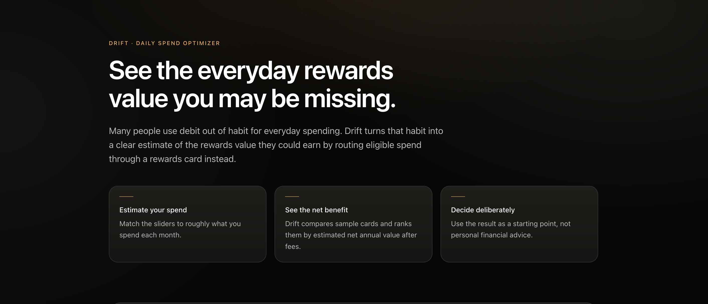
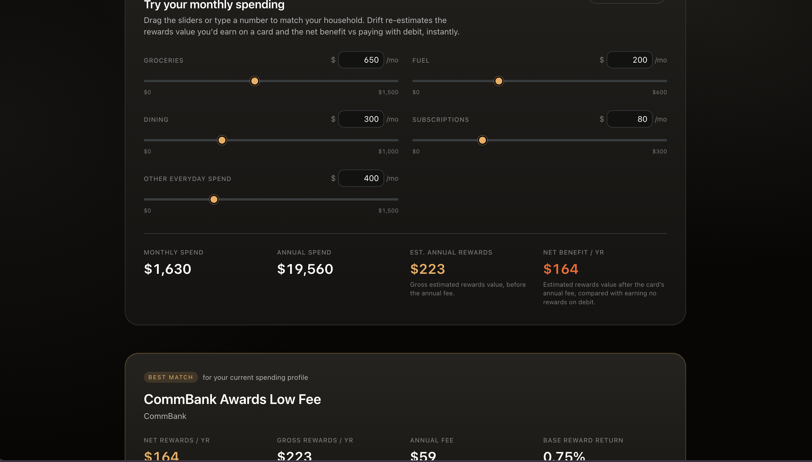
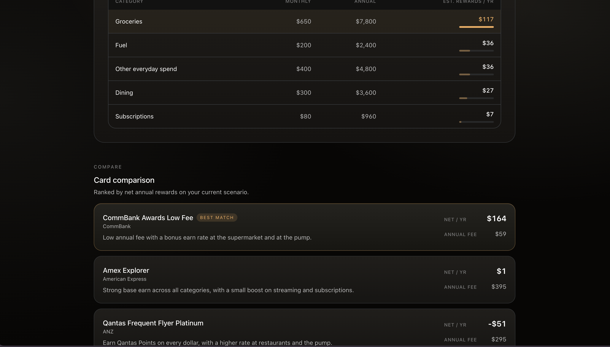

# Drift — Daily Spend Optimizer

Model everyday spending, compare sample rewards-card scenarios, and estimate annual net benefit in seconds.

[](https://nextjs.org/)
[](https://react.dev/)
[](https://www.typescriptlang.org/)
[](https://tailwindcss.com/)
[](https://vitest.dev/)
[](https://vercel.com/)
[](./LICENSE)

**Live demo:** [drift-perkycoders.vercel.app](https://drift-perkycoders.vercel.app)

> ⚠️ **Not financial advice.** Drift uses mocked, sample card data and simplified assumptions purely to demonstrate a decision-support model. It does not recommend real financial products. See [Disclaimer](#disclaimer).

## Screenshots

| Hero | Adjust spending |
|:---:|:---:|
|  |  |

| Card comparison |
|:---:|
|  |

## What is Drift?

Drift is a **financial decision-support demo** that helps users understand how everyday spending patterns affect *estimated* rewards-card value. It uses simplified mock card data and transparent assumptions to show the trade-off between gross rewards, annual fees, and net benefit.

- **Who it's for:** recruiters and engineers evaluating product/engineering craft, and anyone curious how a "should I use my rewards card more?" feeling could be turned into a concrete number.
- **What it solves:** the value of a spending habit is diffuse and delayed, so it never feels worth reasoning about — even though it compounds over a year. Drift makes that value visible and immediate.
- **What it deliberately does not do:** it does not import bank data, match you to a real card, check eligibility or credit score, model interest/fees/points caps, or use live financial data. It is a **portfolio / product-engineering project**, not a production financial comparison tool.

## Why I built it

Most people have a rewards card sitting in their wallet but still reach for debit out of habit — the rewards left on the table are real money, but invisible, so the habit never changes. I wanted to turn a vague "I should probably use my rewards card more" into a concrete number, while practicing the product thinking behind decision-support tools: picking **one honest metric** (net annual benefit), being upfront about what the model doesn't know, and keeping the transparency of assumptions front and center.

## Features

### Scenario modelling
- Five everyday monthly spend categories (groceries, fuel, dining, subscriptions, other)
- Paired sliders and numeric inputs per category, with inputs clamped to a sane range
- Live recalculation on every change — no submit step
- One-click reset back to a representative sample scenario

### Rewards comparison
- Gross annual rewards and net annual rewards (after the annual fee)
- Best-match card highlighted for the current scenario
- Side-by-side ranking of all sample cards, sorted by **net** annual rewards

### Explainability
- Category opportunity breakdown, ranked by estimated annual contribution
- "How this is calculated" walkthrough in plain language
- Standalone, visible trust/disclaimer notice
- Clearly stated model assumptions (see below)

### Engineering
- Pure, side-effect-free calculation core, fully unit tested
- UI state and business logic kept separate
- Responsive layout down to mobile widths
- No backend, database, or auth — everything runs client-side for the session

## What this project demonstrates

- Product thinking applied to a constrained, financial-adjacent decision-support problem
- A transparent, explainable calculation model instead of a black-box recommendation
- Strong TypeScript domain modelling (`RewardsCard`, `SpendingSummary`, `CardRewardEstimate`, etc.)
- Clean separation between UI components and pure business logic
- A responsive React/Next.js implementation with no external UI library
- Unit tests covering the calculation core's correctness, including edge cases
- Deliberate trust and disclaimer design for a domain where over-claiming would be harmful

## Calculation assumptions

- **Points are valued at roughly 1 cent each** — a simplification; real value varies by program and redemption type.
- **Sample cards are mocked**, loosely modelled on common AU card archetypes (frequent-flyer, premium base-earn, low-fee everyday) — not a live feed.
- **Debit is modelled as earning zero rewards**, so "net benefit" equals the best card's net annual rewards.
- **Best card = highest net annual rewards** (gross rewards minus the annual fee).
- **Not modelled:** sign-up bonuses, points caps, interest charges, late fees, foreign-transaction fees, eligibility checks, credit score, or personal financial circumstances.
- **Rewards cards can be harmful** if the balance isn't paid in full — interest typically outweighs any rewards value.

## Limitations

- Only three sample cards are included; they are mock data, not a real card registry
- The reward model is intentionally simplified (flat category rates, no tiers or caps)
- No modelling of interest, fees, sign-up bonuses, eligibility, or credit checks
- Not personal financial advice, and not a comparison of real financial products
- No backend, so nothing persists beyond the current browser session
- All figures are **illustrative only** and should not be relied on for real decisions

## Disclaimer

All calculations are illustrative and based on simplified mock assumptions. Drift is for demonstration purposes only and is **not financial advice**. It does not account for eligibility, ongoing interest charges, late fees, foreign-transaction fees, sign-up bonuses, points caps, your credit score, or your personal financial circumstances. A rewards card only makes sense if you pay your balance in full every month — carried-interest charges typically outweigh any rewards value.

## Architecture

- **`src/components/SpendingScenario.tsx`** — client component owning UI state (spend inputs), derived view calculations, and the summary/ranking display
- **`src/data/cards.ts`** — mock card data, default sample scenario, and category labels/slider ranges
- **`src/lib/rewards.ts`** — pure calculation and formatting logic (no React, no side effects)
- **`src/types/index.ts`** — shared TypeScript domain types
- **`src/lib/rewards.test.ts`** — unit tests for the calculation helpers

## Tech stack

- [Next.js](https://nextjs.org/) 15 (App Router)
- [React](https://react.dev/) 19
- [TypeScript](https://www.typescriptlang.org/) (strict)
- [Tailwind CSS](https://tailwindcss.com/) 3
- [Vitest](https://vitest.dev/) for unit tests
- Deployed on [Vercel](https://vercel.com/)
- No backend, no database, no auth, no external UI library — all state lives in the browser for the current session

## Run locally

```bash
npm install
npm run dev
```

Open <http://localhost:3000>.

```bash
npm run lint       # ESLint
npm run typecheck  # tsc --noEmit
npm run test       # Vitest unit tests
npm run build      # production build (also type-checks and lints)
```

## Project structure

```
src/
  app/                              # App Router: page, layout, global styles
  components/
    SpendingScenario.tsx            # Client: owns state, inputs, summary, ranking
    CategoryOpportunityBreakdown.tsx
    HowItsCalculated.tsx
    TrustNotice.tsx
  data/cards.ts                     # Mock cards, default scenario, category labels
  lib/rewards.ts                    # Pure calculation and formatting helpers
  lib/rewards.test.ts               # Unit tests for the calculation core
  types/index.ts                    # Shared TypeScript types
```

## Future improvements

> These are roadmap ideas only — none of the following are implemented.

- A real, periodically refreshed card registry behind the existing typed schema, replacing the three sample cards
- CSV import or manual transaction upload, so spend doesn't have to be estimated by hand
- A sensitivity view showing how the recommendation shifts as the points value moves between roughly 0.5 and 2 cents per point
- Charts for the category breakdown and "what if I shifted X% of my spend" projections
- Deeper accessibility polish: explicit focus-ring tokens, reduced-motion handling, live regions for scenario stats
- Export or share a scenario summary
- Additional scenario presets beyond the single default

---

<div align="center">

### `> ping --author`

```text
> Target     : Pouya Alavi Naeini — Software Engineer | Applied AI/ML
> University : Macquarie University, Sydney, NSW
> Major      : B.IT — Artificial Intelligence & Web/App Development
> Status     : [●] ONLINE — open to grad & junior opportunities
```


[](https://www.linkedin.com/in/pouya-alavi/)
[](https://github.com/mrpouyaalavi)
[](mailto:pouya@pouyaalavi.dev)

<br/>

*Originally developed as a time-boxed product engineering exercise and later refined as a portfolio project.*

<div/>

